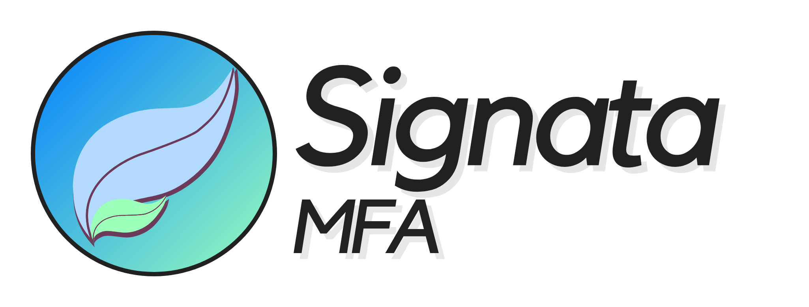

# Signata MFA Documentation

This repository contains all documentation for the Signata MFA product.

You can get Signata MFA here: [https://mfa.signata.net/](https://mfa.signata.net/)

You can also access support here: [https://congruentlabs.atlassian.net/servicedesk/customer/portal/2](https://congruentlabs.atlassian.net/servicedesk/customer/portal/2)

If you find any problems with this documentation, please raise an issue here or at the support portal above.

## Signata MFA: Standalone

Signata MFA: Standalone Edition (Signata Standalone) is a product that allows the issuance of PKI certificates onto YubiKeys for users within your network. Because Signata Standalone leverages existing services within your network, additional steps are required to be completed to ensure your network is ready for integration. The documents in this repository details these steps, and it is recommended that the linked documents below are reviewed before attempting to integrate Signata Standalone, as you may be delayed in getting some pre-requisites configured first.

Some of the pre-requisites include:

* Access to an Active Directory Domain Services (ADDS) server that Signata can connect to read identity information for your users.
* Access to an Active Directory Certificate Services (ADCS) server that Signata can connect to for requesting certificates.
* Modification/Configuration of Certificate Templates for Signata to be able to request certificates for users.
* A server within your network that the Signata service can be installed on to, and IIS also enabled for use as a reverse proxy.

These documents aim to provide guidance for configuration of the services in the most simple and optimal manner.

### Table of Contents

* [Standalone Server Installation Guide](guide-standalone-server-installation.md)
* [Standalone Client Installation Guide](guide-standalone-client-installation.md)
* [Standalone Troubleshooting Guide](guide-standalone-troubleshooting.md)

## Signata MFA: Cloud

Signata MFA: Cloud Edition (Signata Cloud) is a product that allows the issuance of YubiKeys for users within your network. Signata Cloud provides a dedicated PKI for your organisation, leaving you to just install the desktop client, install trust for the PKI, and connect your favourite Identity Store to start issuing YubiKeys.

This service is still being built. If you'd like to be one of the first users to try to it out, please [contact support by clicking here](https://congruentlabs.atlassian.net/servicedesk/customer/portal/2).

### Table of Contents

Coming Soon!
