# Signata MFA Client Installation Guide

- [Signata MFA Client Installation Guide](#signata-mfa-client-installation-guide)
  - [Client Package Installation](#client-package-installation)
  - [Launching the Client](#launching-the-client)
  - [Setting the Encryption Key](#setting-the-encryption-key)
  - [Creating a Password](#creating-a-password)
  - [Selecting Enrollment Agent](#selecting-enrollment-agent)
  - [Enabling Certificate Templates](#enabling-certificate-templates)
  - [Configuring Device Policies](#configuring-device-policies)

## Client Package Installation

Download and run the **Signata Standalone Client Setup.exe** installer.

The installation wizard will appear and will install the application automatically.

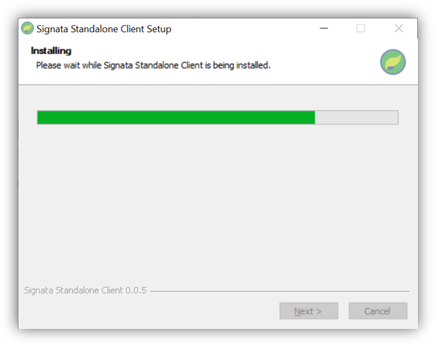

When the installation is complete, click **Finish**.

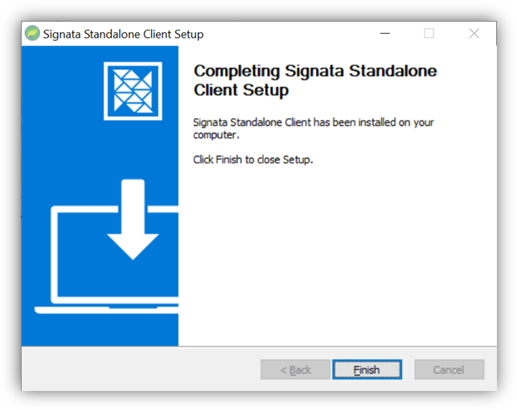

## Launching the Client

On first launching the client, you will be asked to provide the **Hostname** and **API Key** for the server connection. Please provide the Reverse Proxy hostname for your Signata Standalone server, and the GUID part of your Client API Keys configured in the Server Installation steps. Click **Test & Save Server Settings**.

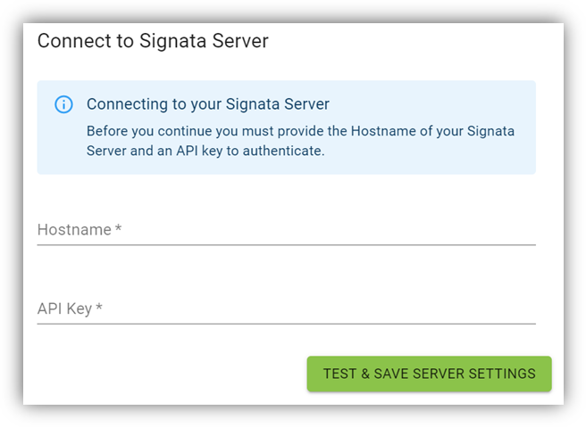

If you see a warning from Windows Firewall , make sure you just tick Private networks, such as my home or work network and click Allow access.

> Signata connects to your devices using a protocol called gRPC – this protocol is network based, which is why firewall rules are needed to be created for it to work correctly.

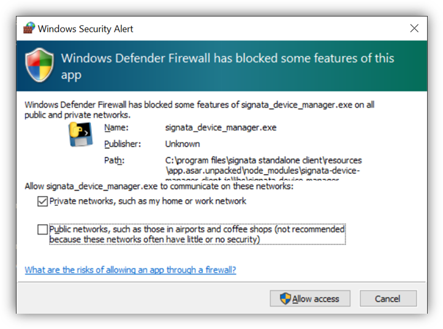

If this is the first time your client is connecting to the server, then you will be asked to set up the database for the first time. Click **Set Up Database** to continue.

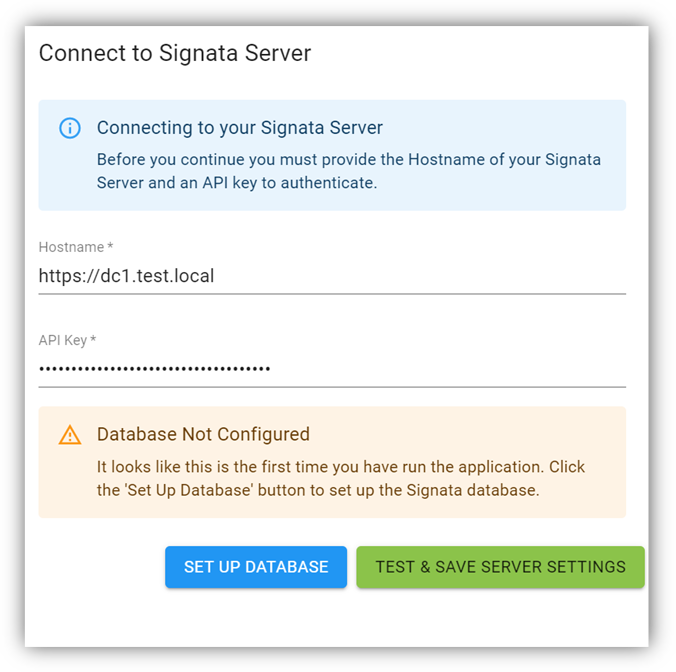

## Setting the Encryption Key

All secrets in the Signata Standalone client are encrypted, and the server never knows the secrets. This ensures that if your Signata Standalone server is ever compromised, no-one can access the secrets created for all of your devices.

The encryption key is derived from a 12-word *mnemonic* . You can easily write this mnemonic down on a piece of paper, and/or store it in a secure password manager.

> The mnemonic is created using the BIP39 standard: https://github.com/bitcoin/bips/blob/master/bip-0039.mediawiki 

**Warning**: if this encryption key is ever lost, you can never recover the secrets that have been created from it in Signata. If someone steals this mnemonic, then they can decrypt all secrets that have been created from it in Signata.

You can use the Generate button to create a new encryption key, and the Copy button to copy the text to your clipboard. We don’t allow you to create your own encryption key – you must generate a new random one when setting up the application.

Ensure that you save the copy **before** you click **Set New Encryption Key** – this way you can be certain you have a spare copy saved first.

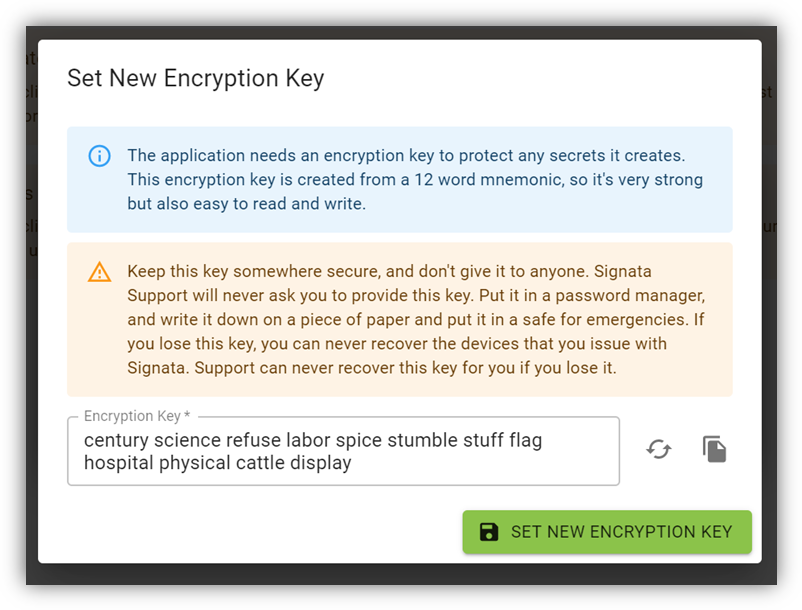

## Creating a Password

It is cumbersome to type in a 12-word mnemonic every time you launch Signata, so you can set your own personal password to also unlock the application. This password encrypts a copy of the mnemonic locally, and it only set for your instance of the client.

When Signata starts, you will be required to enter your Encryption Key. To set up a password instead, click **Use Password**.

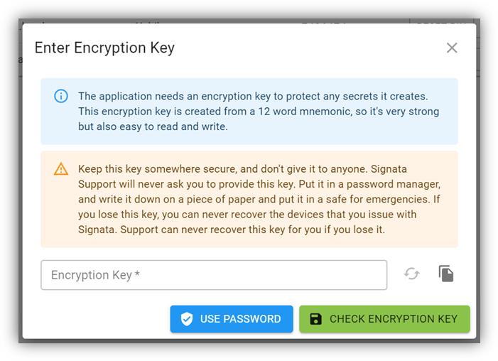

You will then just need to provide the Encryption Key and your new desired password and click **Set New Password**. The password will need to be at least 12 characters long.

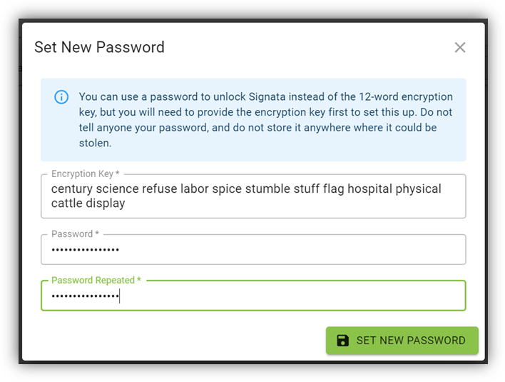

## Selecting Enrollment Agent

To set an Enrollment Agent, click the **Set Enrollment Agent** button from the main screen.

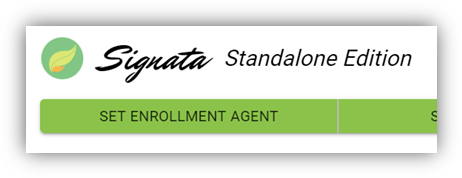

If your server has certificates configured in the Personal certificate store for the service account, then you will see them as options in the list. Click to select the certificate that is the Enrollment Agent that you will be using. You can identify that it is the correct certificate by comparing the Thumbprint shown with the thumbprint of the actual certificate.

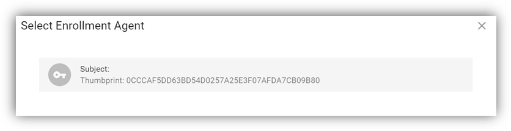

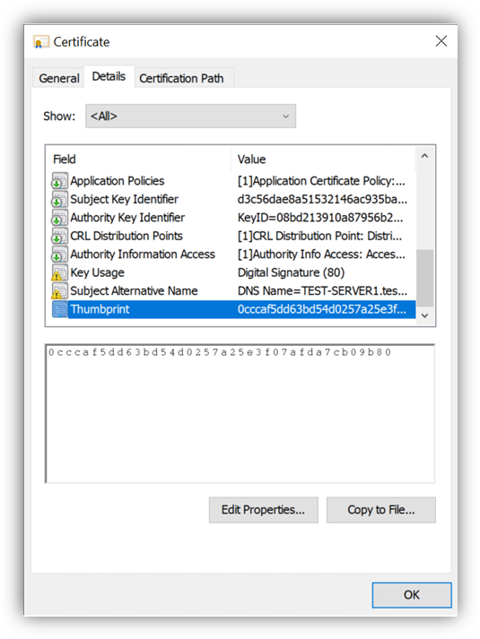

Setting the Enrollment Agent for the first time will set it for all clients simultaneously. Should you need to change the certificate later, simply click the **Edit Enrollment Agent** button from the main screen.

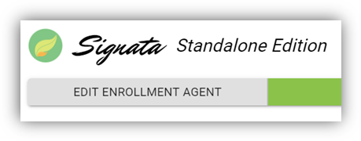

## Enabling Certificate Templates

When you click on the **Set Templates** button from the main screen, the templates list will be loaded.

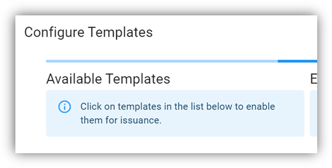

If you have configured your *MSCertificateAuthority* setting correctly in the server setup you will see the list of **Available Templates** filled with all the templates that your server service account can see.

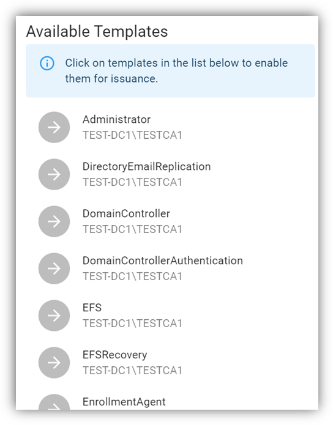

Simply click on each template that you want to make available for use by Signata to put them into the **Enabled Templates** list, and then click **Save & Close**.

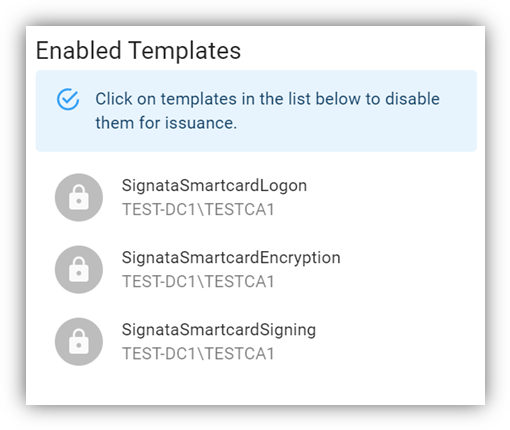

## Configuring Device Policies

The last step to configuring the Signata client is to click on the **Set Policies** button on the main screen.

A Policy Form will appear. You need to provide a **Policy Name** and pick at least one Certificate Template mapping to create a valid Policy. The policy name must be unique, and it is recommended to provide a short description for the purpose of the policy.

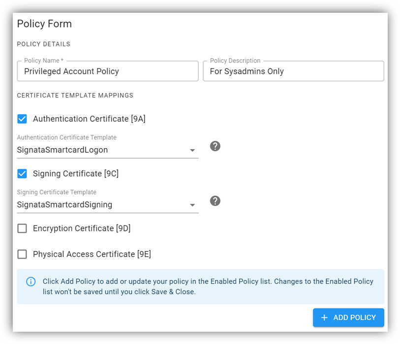

Once you have set your device policy, click **Add Policy**. This won’t yet save your policy, it will just be added to the Enabled Policies list at the bottom of the page. If you are satisfied with the policies you have created, then simply click **Save & Close**.

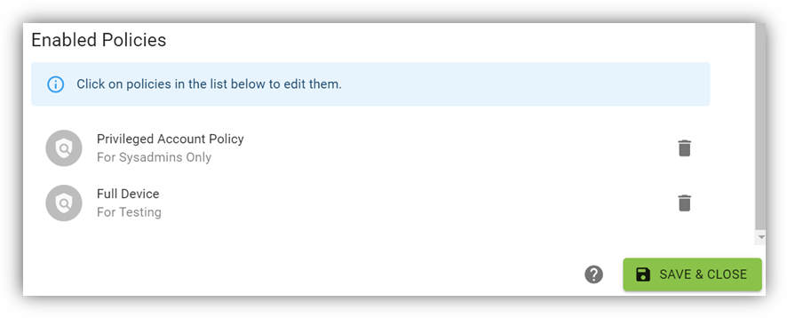

To edit enabled policies, simply click on them in the list and their details will be loaded into the Policy Form for you to view and edit. Simply click **Add Policy** to save your changes, but please note that changing the Policy Name will not overwrite the old policy and will instead create a new one.

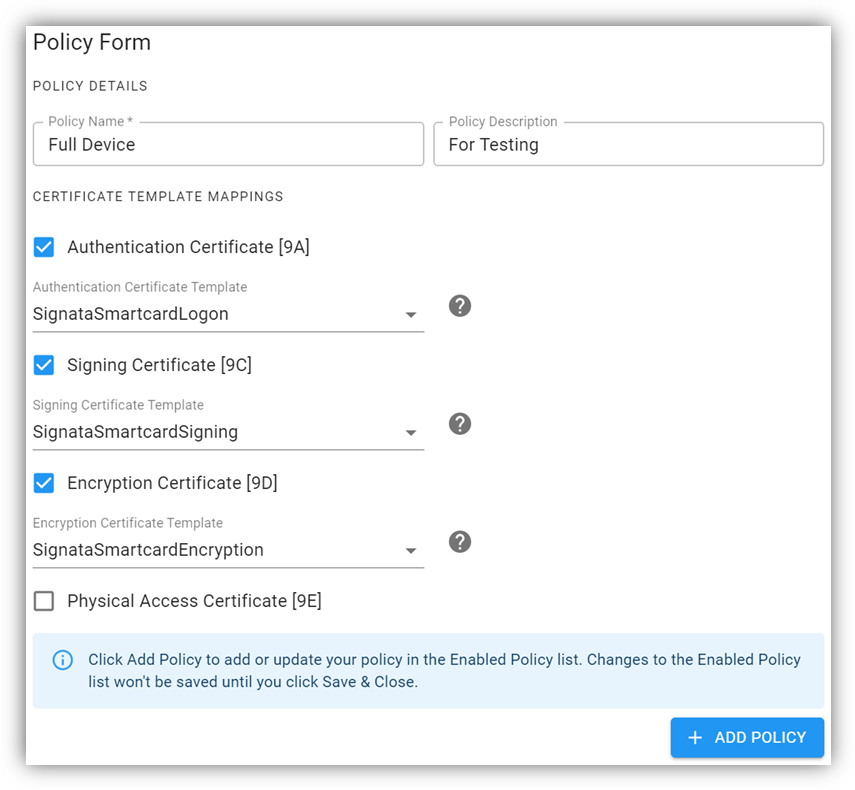
