# Signata MFA Standalone Server Installation Guide

- [Signata MFA Standalone Server Installation Guide](#signata-mfa-standalone-server-installation-guide)
  - [Minimum Requirements](#minimum-requirements)
  - [Firewall Rules](#firewall-rules)
  - [Standalone Service Installation](#standalone-service-installation)
  - [Service Account Creation](#service-account-creation)
  - [IIS & Reverse Proxy Configuration](#iis--reverse-proxy-configuration)
    - [Enabling IIS](#enabling-iis)
    - [Installing Reverse Proxy Modules](#installing-reverse-proxy-modules)
    - [Configuring the Reverse Proxy](#configuring-the-reverse-proxy)
  - [Certificate Template Configuration](#certificate-template-configuration)
    - [Enrollment Agent Configuration](#enrollment-agent-configuration)
    - [End User Certificate Templates](#end-user-certificate-templates)
      - [9A Authentication Key](#9a-authentication-key)
      - [9C Signing Key](#9c-signing-key)
      - [9D Encryption Key](#9d-encryption-key)
      - [9E Card Authentication Key](#9e-card-authentication-key)
  - [Signata Standalone Service Configuration](#signata-standalone-service-configuration)
    - [Directory Configuration](#directory-configuration)
    - [Certificate Authority Configuration](#certificate-authority-configuration)
    - [API Key Configuration](#api-key-configuration)
    - [Product Licence](#product-licence)
  - [Post Configuration](#post-configuration)

## Minimum Requirements

At a minimum, you will need:

1. A server that you can install the Signata Standalone service on to.
2. A service account with read-only rights for your Active Directory.
3. An ADCS Enterprise-type PKI available in your network.

## Firewall Rules

The Signata Standalone server only requires a few rules to be configured to operate.

Purpose | Source | Destination | Port | Protocol
------- | ------ | ----------- | ---- | --------
LDAPS | Signata Server | Domain Controller | 636 | TCP
HTTPS | Signata Client(s) | Signata Server | 443 | TCP

Traffic from the Signata Server to the Enterprise Certificate Authority is via standard DCOM services, which are assumed to be open and available for connectivity within the same domain. Running Signata Standalone on a server in a different domain to the certificate authority is not recommended.

## Standalone Service Installation

1. Download and run the **Signata Enterprise Standalone.exe** installer.

2. The installation wizard will appear. Click **Next**.

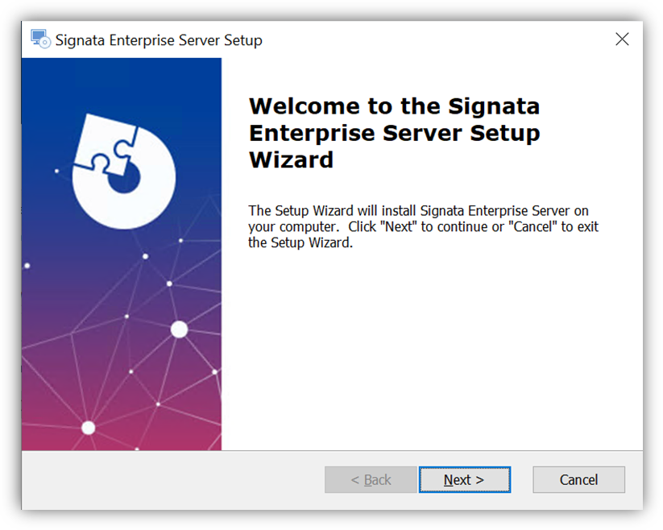

3. Click **Next**.

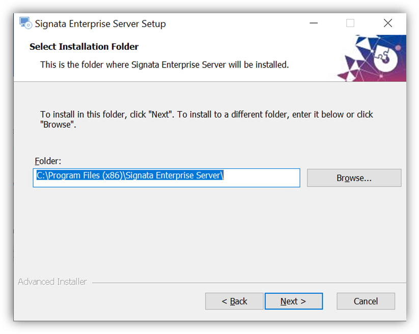

4. Click **Install**.

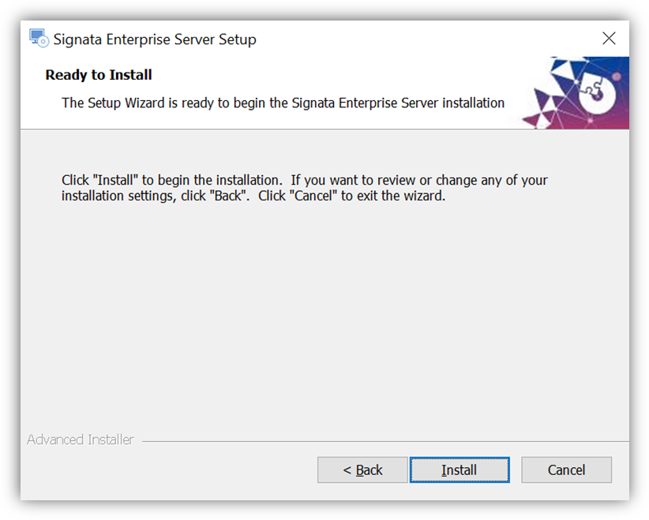

5. Click **Finish**.

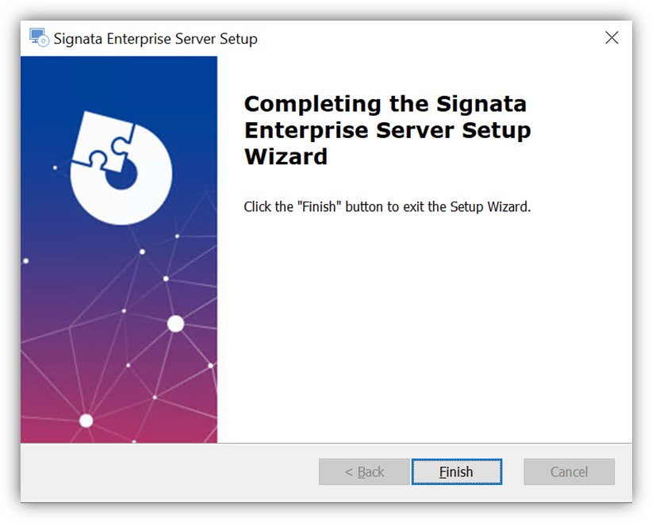

6. Once the package has installed, the _Signata Enterprise Service_ will be running. Stop the service for now, as additional configuration is required before you can start it again.

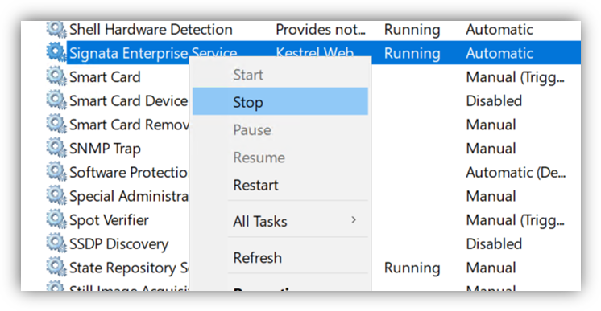

## Service Account Creation

Signata Standalone requires a domain service account to operate. This account can simply be a member of Domain Users, just so it has enough privileges to be able to read user objects in your directory and to run the Signata Enterprise Service, but nothing more.

The name of the account is not important, but it can be useful to name it specifically to identify that it is for Signata Standalone (e.g. svc_signata@yourdomain.com).

Please ensure that the password for this service account does not contain any reserved JSON characters. This includes single quotes (‘), quotes (”), and backslashes (\).

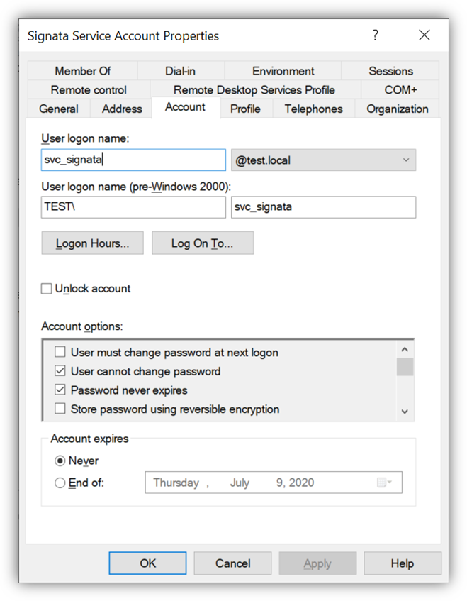

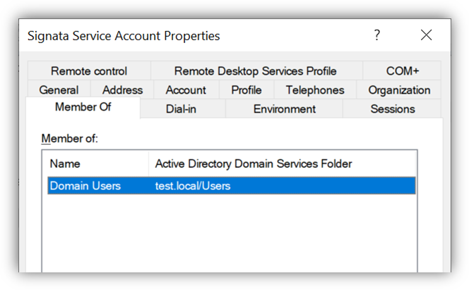

(If you are forced to use a password containing these reserved characters, you will need to escape the characters when you edit the appsettings.json file in later steps. Contact Signata Support if you need assistance with escaping these characters correctly.)

Once you have created this service account, modify the _Signata Enterprise Service_ to Log On as the service account.

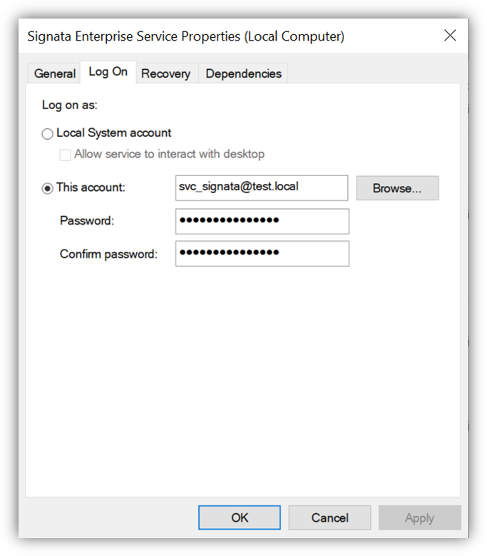

And finally modify the **C:\ProgramData\Signata\signata-enterprise.sqlite** database file to allow Full control to the service account.

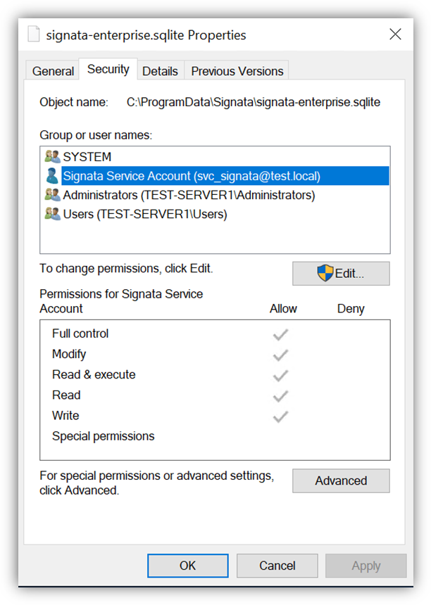

## IIS & Reverse Proxy Configuration

In it’s default configuration the Signata Standalone service runs on http://localhost:5000 – that is, it is only listening on the local network adapter on port 5000, and it is not TLS-enabled. It will not respond to any connection requests from other computers in your network.

It is recommended to configure a Reverse Proxy to sit in front of the Signata Standalone service, and this Reverse Proxy should be configured to allow in-bound connections from other servers, and have TLS enabled and enforced. It is not recommended to use the Signata Standalone service as the service that your clients will directly connect to, as it is using a Microsoft Kestrel web server [which is not recommended for direct connections by outside services](https://docs.microsoft.com/en-us/aspnet/core/fundamentals/servers/kestrel?view=aspnetcore-3.1#when-to-use-kestrel-with-a-reverse-proxy).

As Signata Standalone only works on Windows, it is easiest to use IIS as a reverse proxy as it can be enabled as a role on the server and configured as a reverse proxy with the addition of 2 modules provided by Microsoft.

### Enabling IIS

1. First, to enable IIS, open Server Manager and use the **Add Roles and Features Wizard**. Click **Next**.

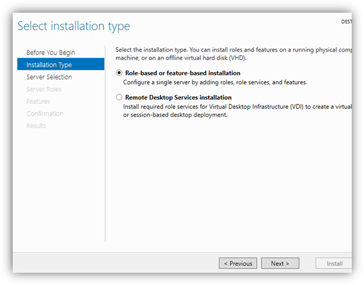

2. Click **Next**.

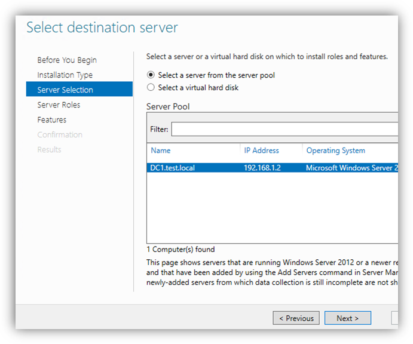

3. Tick **Web Server (IIS)**.

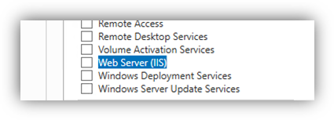

4. When prompted to add required features, click **Add Features**.

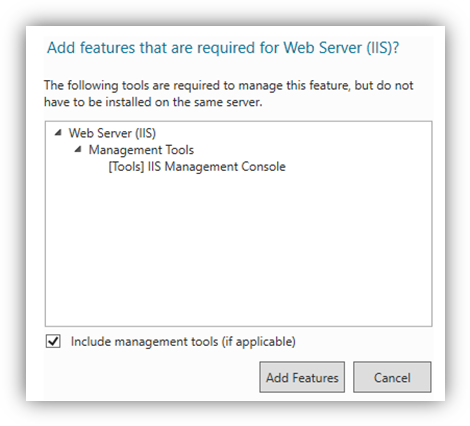

5. Click **Next**.

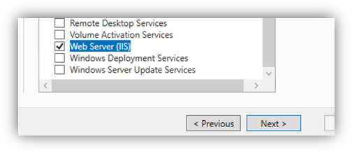

6. Click **Next**.

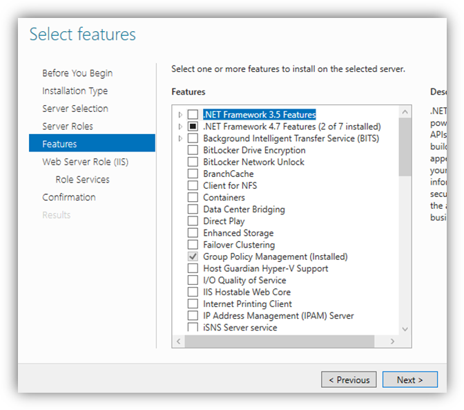

7. Click **Next**.

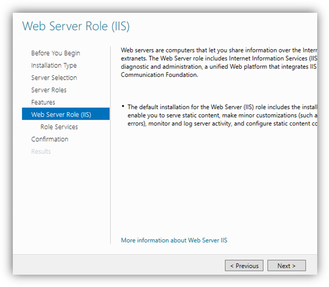

8. You can leave all the role services as their defaults and click **Next**.

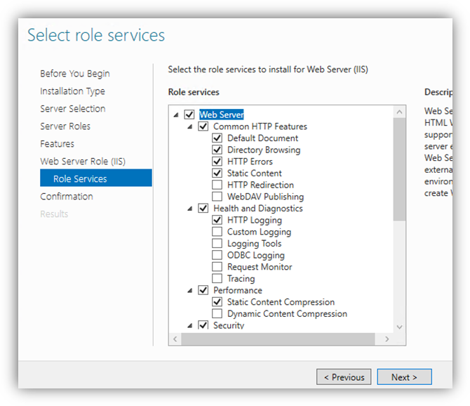

9. Click **Install**.

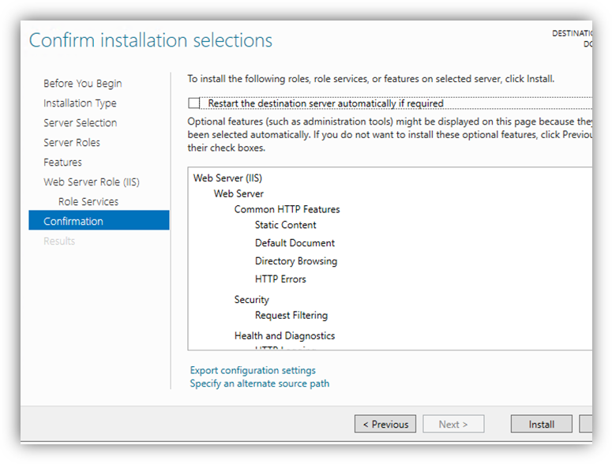

### Installing Reverse Proxy Modules

Next, we need to install two modules for IIS: Application Request Routing and URL Rewrite.

Application Request Routing can be downloaded directly from Microsoft at: [https://www.iis.net/downloads/microsoft/application-request-routing](https://www.iis.net/downloads/microsoft/application-request-routing) (note: use the “additional downloads” option to get the offline installer).

URL Rewrite can be downloaded directly from Microsoft at: [https://www.iis.net/downloads/microsoft/url-rewrite](https://www.iis.net/downloads/microsoft/url-rewrite) (note: use the “additional downloads” option to get the offline installer).

1. On the same IIS server, run the installer for the Rewrite module.

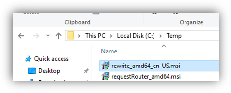

2. Tick **I accept the terms in the License Agreement** and click **Install**.

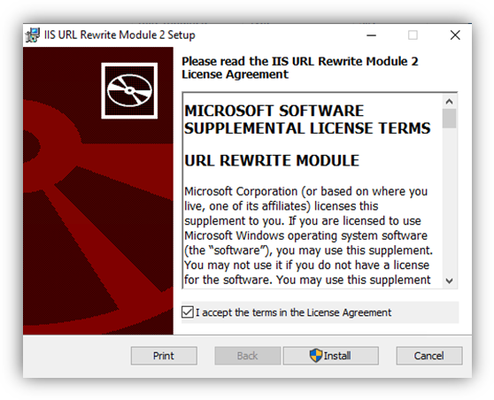

3. Click **Finish**.

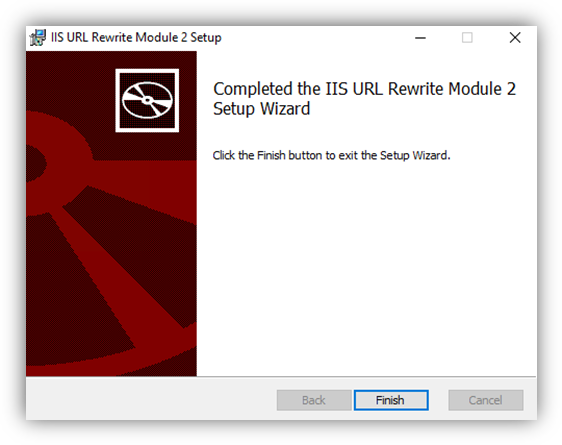

4. On the same IIS server, run the installer for the Request Router module.

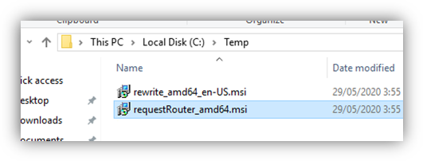

5. Tick **I accept the terms in the License Agreement** and click **Install**.

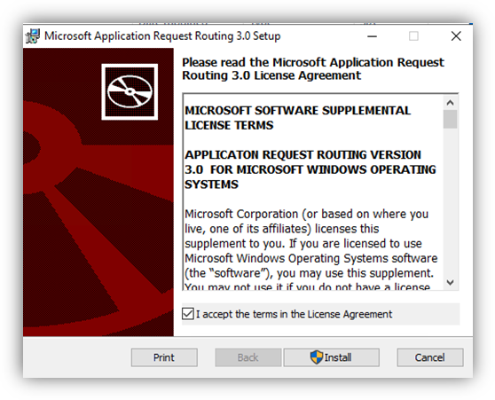

6.  Click **Finish**.

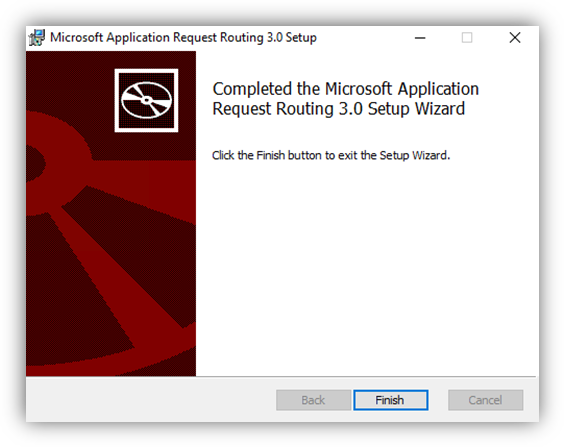

### Configuring the Reverse Proxy

1. To configure an IIS Reverse Proxy, open **IIS Manager** and click on the **Default Web Site**.

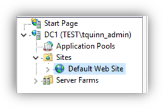

> Note: using the Default Web Site will override any other web server you may have already installed on the server. If you wish to host the Signata Reverse Proxy alongside other services, you can register it as a separate web site and run it on any port you desire.

1. Double-click on the **URL Rewrite** module.

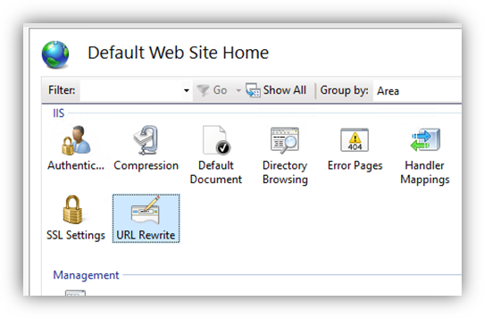

2. Click **Add Rule(s)…**.

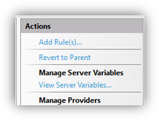

3. Select **Reverse Proxy** and click **OK**.

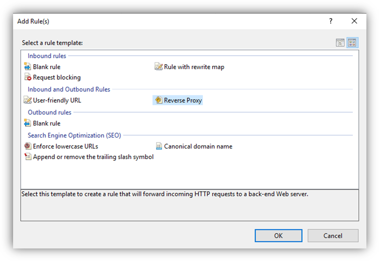

4. Click **OK**.

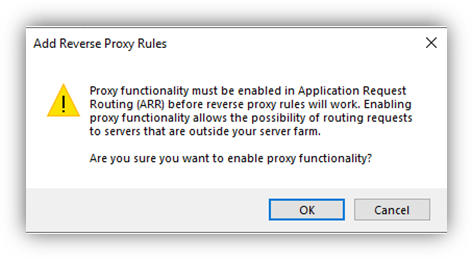

5. Set the server name to **127.0.0.1:5000** and click **OK**.

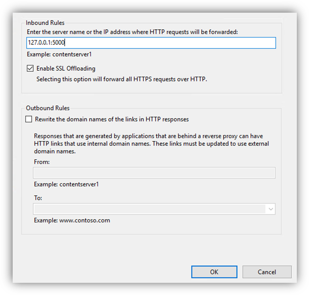

6. Your reverse proxy should now be active. If you have a valid web server certificate available, ensure you also add the binding for the Default Web Site to include **https** and the configured certificate.

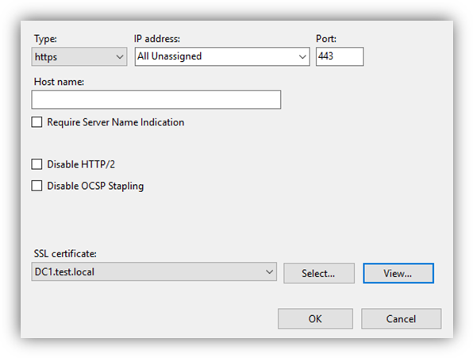

## Certificate Template Configuration

### Enrollment Agent Configuration

Signata Standalone requires an Enrollment Agent certificate to work. This is a special type of certificate that lets the Signata Standalone service request certificates on behalf of other users in your domain.

Whilst in a lot of cases you can use existing certificate templates in your domain, it is recommended for Signata to have its own Enrollment Agent template, so you can tightly control the creation of the Enrollment Agent certificate for the services.

When the Signata Standalone service runs, it will only look for and use Enrollment Agent certificates in the Personal store of the account running the service. For example, if your service is running with the account svc_signata@test.local, then that account’s Personal certificate store needs to be loaded with an Enrollment Agent certificate.

> Warning: Incorrect Enrollment Agent permissions can result in allowing an attacker to compromise your systems by impersonating other users.

1. To create an Enrollment Agent template, run **certtmpl.msc** on a domain-connected Windows server. Right-click on the default **Enrollment Agent (Computer)** template and choose **Duplicate Template**.

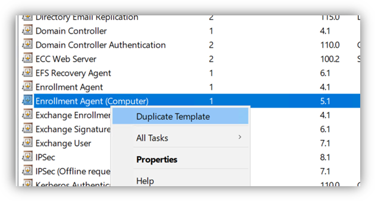

2. Give the template a meaningful name. As it is destined for use by Signata Standalone, calling it something like “Signata Enrollment Agent” is recommended.

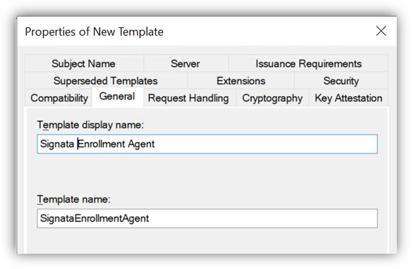

3. Next, go to the **Request Handling** tab and tick **Allow private key to be exported**.

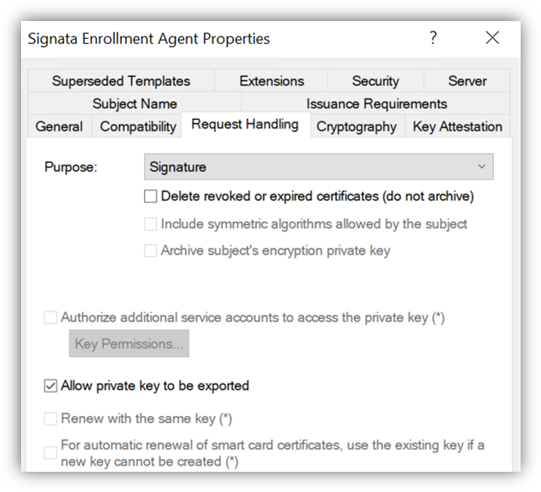

4. And then finally we want to control exactly who can request this type of certificate. Go to the **Security** tab and remove all groups from being allowed to request the certificate, and leave Authenticated Users as Read-only, and add the Signata Standalone server with **Read** and **Enroll** permissions.

> This will ensure that **only** the Signata Standalone server can ever enroll this type of certificate.

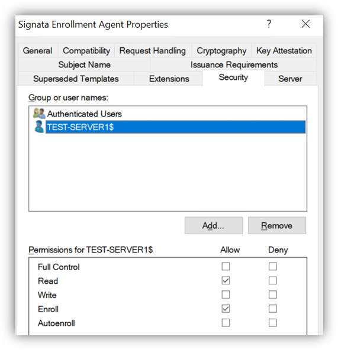

5. Now, we need to request the Enrollment Agent certificate. First, run **certlm.msc** to open up the Local Machine certificate snap-in. Under **Personal > Certificates**, right-click on the folder and choose **All Tasks > Request New Certificate…**.

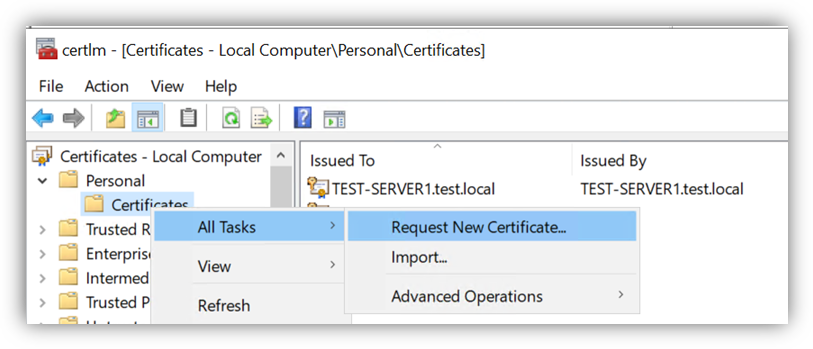

6. Click **Next**.

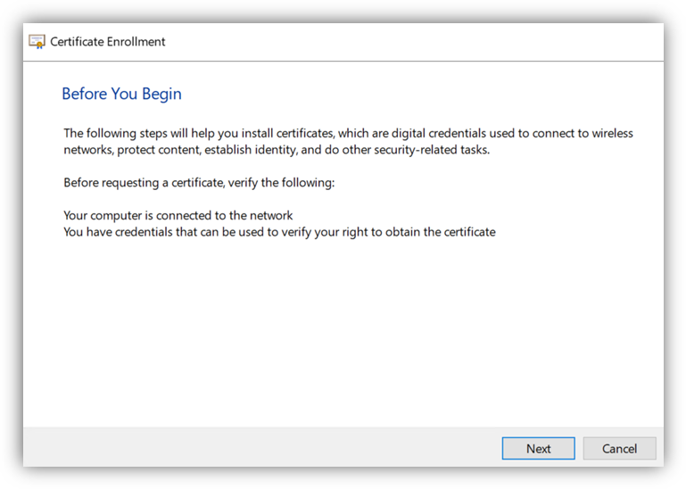

7. Click **Next**.

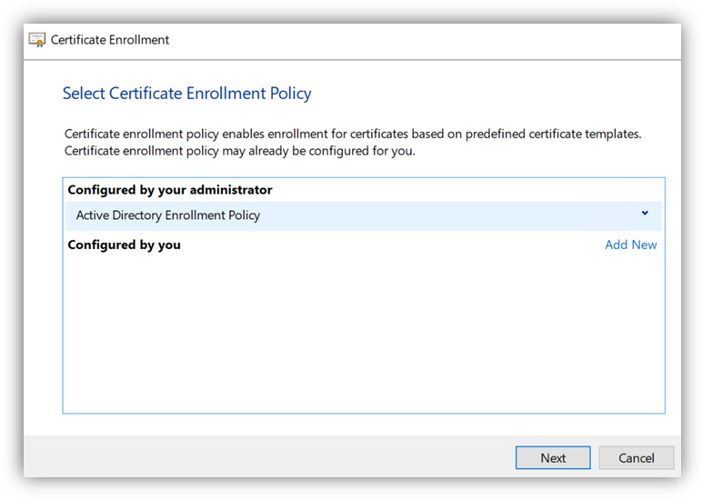

8. Tick the Signata Enrollment Agent certificate type and click Enroll. If you don’t see the policy available to enroll, then check that your permissions are correct on the template..

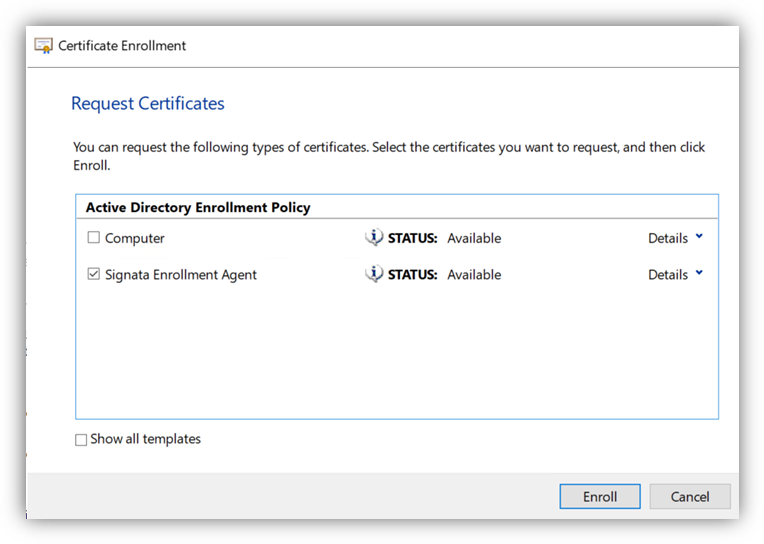

9.  Click **Finish**.

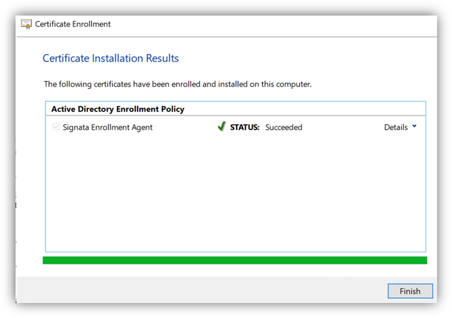

You will now have an Enrollment Agent certificate in the Local Machine store. If there is more than one certificate present you can tell which one it is by it's intended purpose being Certificate Request Agent.

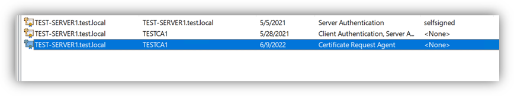

10. Now we need to export it for the Service Account to use. Right-click on the certificate and choose **Export…**.

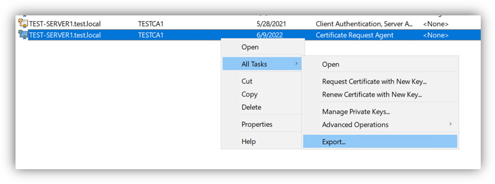

11. Click **Next**.

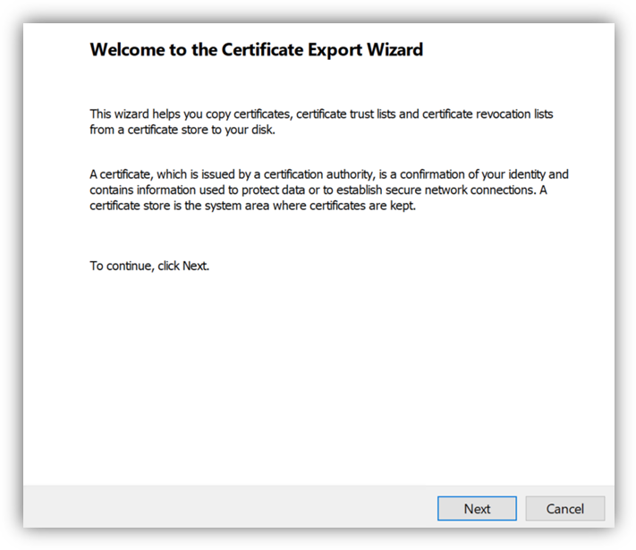

12. Choose **Yes, export the private key** and click **Next**.

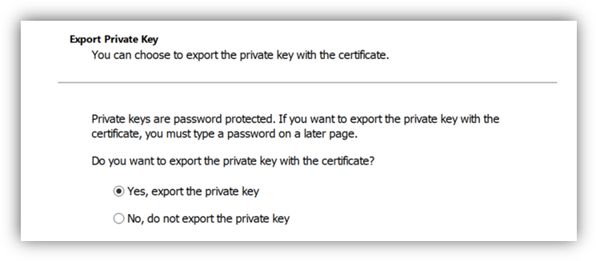

13. Click **Next**.

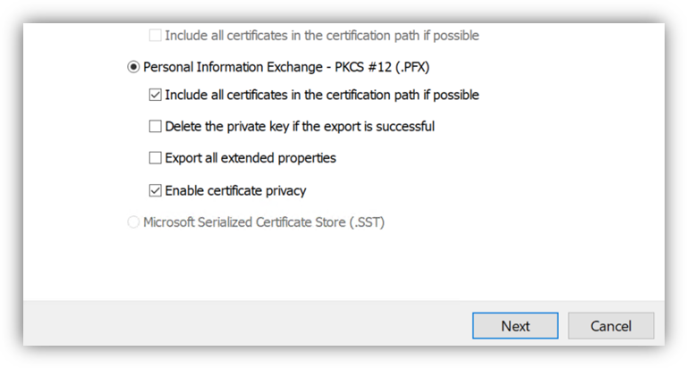

14. Choose the Password option and provide a temporary password. This doesn’t need to be stored long term, as it’s just used temporarily during this key export and import process. Click **Next**.

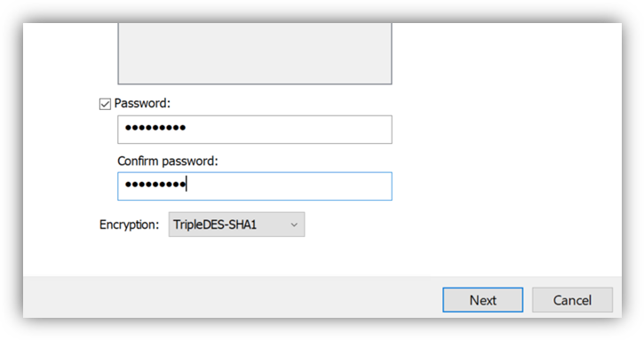

16. Save the file to **C:\Temp** and click **Next**.

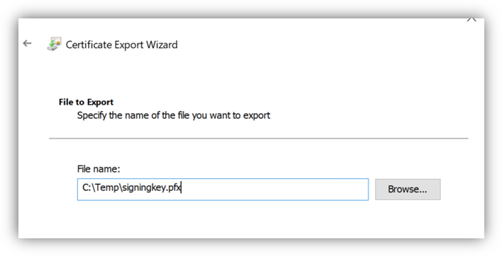

17. Click **Finish**.

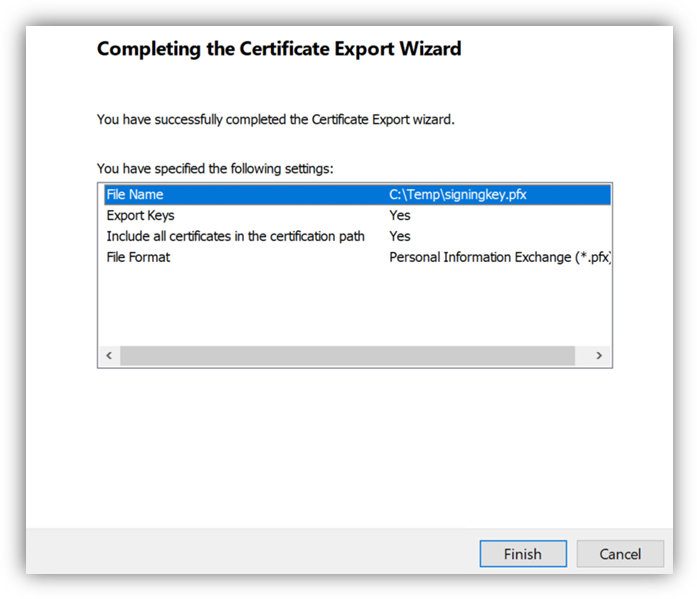

18. Now we need to import the certificate into the Personal Store for the service account. To do this, you can use **runas** to start **mmc.exe** as the Signata Service Account.

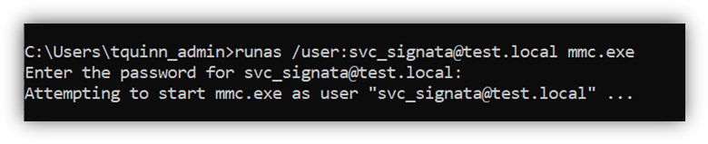

19. When the console opens, choose **File > Add/Remove Snap-in…**.

20. Click **Certificates** and click **Add**, and then **OK**.

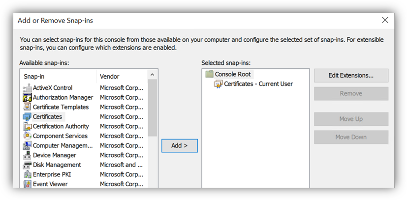

21. Under the **Personal** store, right-click on **Certificates** and choose **All Tasks > Import…**.

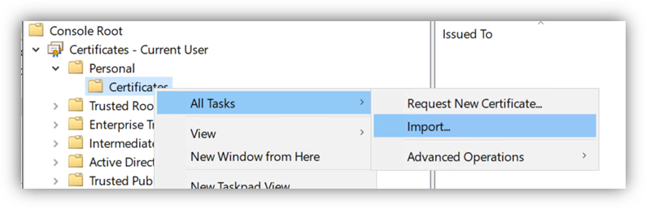

22. Click **Next**.

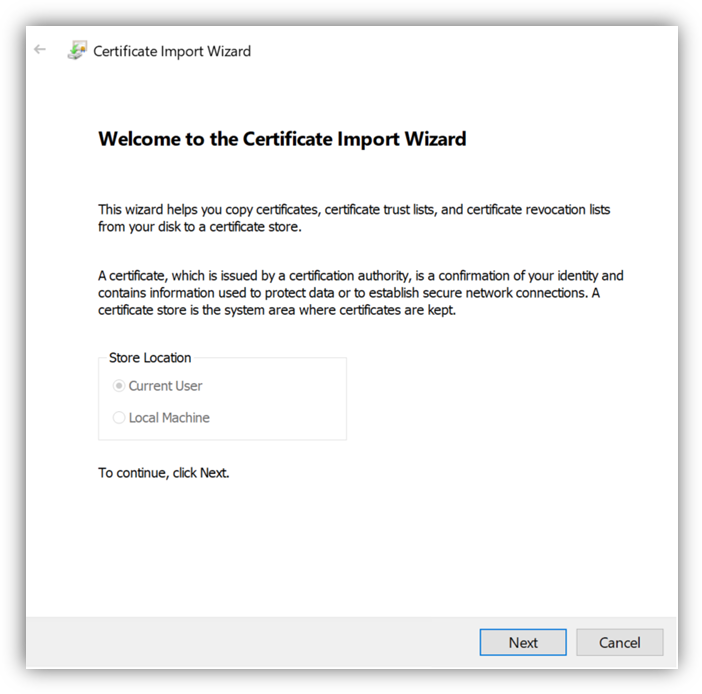

23. Choose the exported file from before. If it doesn’t appear, make sure you change the file types shown in the bottom-right. Click **Open**.

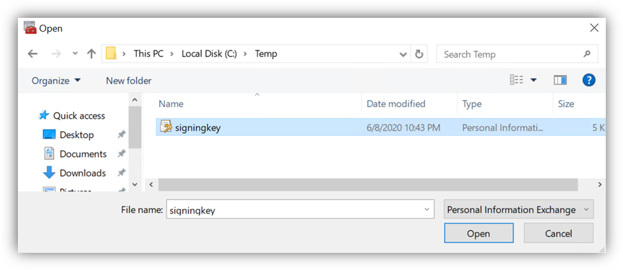

24. Click **Next**.

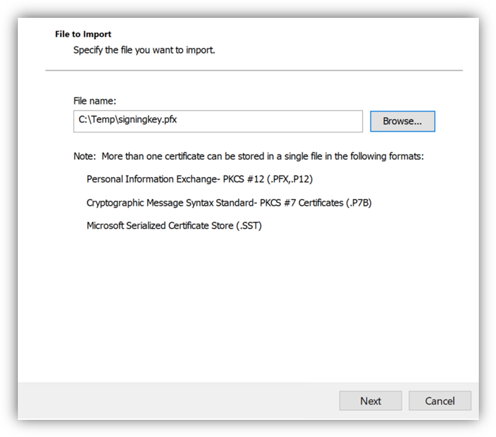

25. Provide the password and click **Next**.

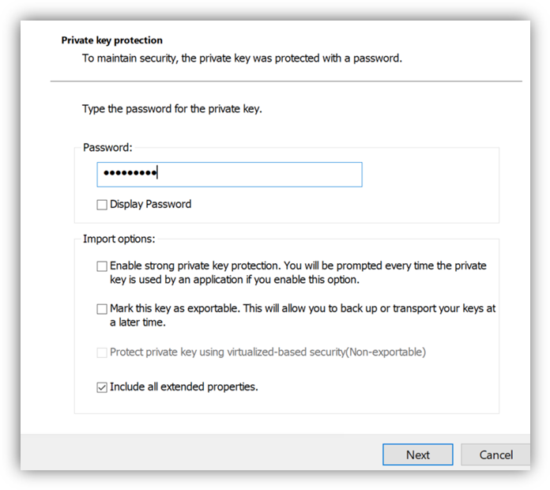

26. Click **Next**.

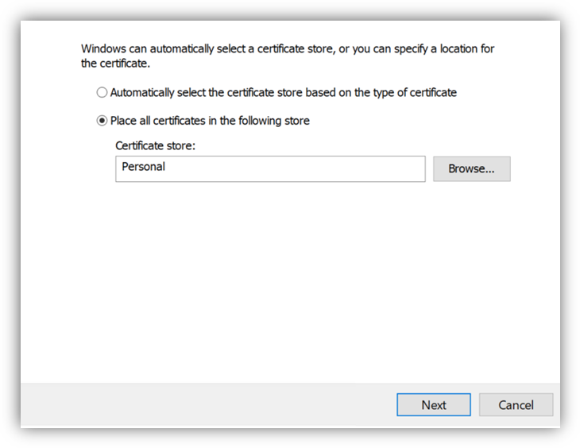

27. Click **Finish**.

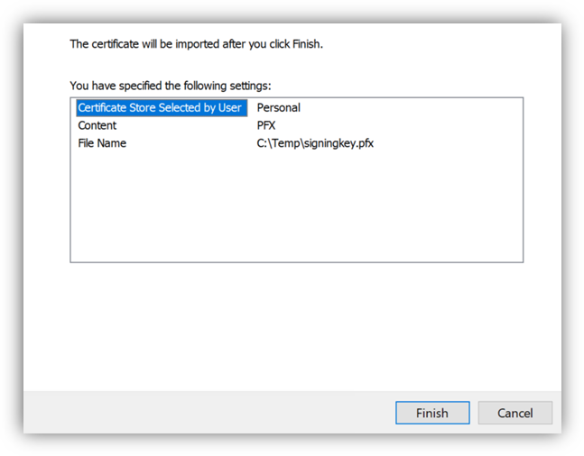

28. You should now have the certificate available for the service account. Make sure you delete the temporary exported certificate, and you can also delete the certificate from the local computer store too.

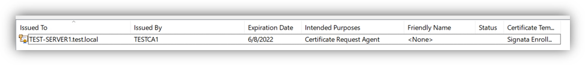

### End User Certificate Templates

Certificates issued to users in Signata need to be defined by templates, and those templates are assigned to slots on your user’s devices for use.

Whilst Microsoft Certificate Authorities come out-of-the-box with several useful templates, some modifications need to be made to them to allow Signata to use them. At a minimum Signata requires the templates to allow private keys to be exported, and to allow enrollment agents to authorize the certificate request.

> Private keys for all certificate types are generated on the Signata server and then injected into the user’s device over a secure connection. Future versions of Signata may include the option to generate the keys on the device instead.

The following are recommended templates and configuration for each slot type for a YubiKey device. It is advised to only assign templates to slots if you intend on using them, otherwise you will make issuing devices take longer than necessary and you will also add unnecessary data to system logs.

#### 9A Authentication Key

The 9A container should only have a key that can be used for authentication to systems. This includes for logon to laptops, desktops, and web sites.

1. To create this certificate template, duplicating the **Smartcard Logon** template that comes with ADCS is a good starting point.

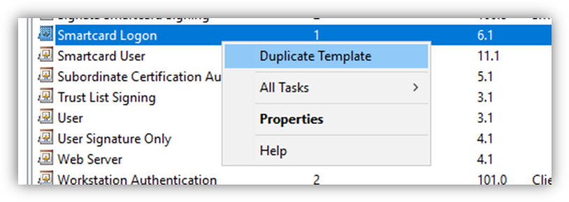

2. You’ll need to change the name of the certificate template. It’s recommended to call the template "Signata Smartcard Logon", so you know that it’s destined specifically for the Signata server.

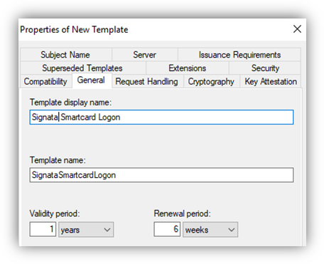

3. Under Request Handling, tick **Allow private key to be exported**.

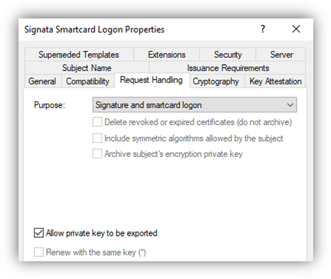

4. Under Issuance Requirements, tick **This number of authorized signatures**, set it to **1**, the Policy type required in signature to **Application policy** and the Application policy **Certificate Request Agent**.

> This setting will ensure that requests for this type of certificate must contain a signature from an Enrollment Agent certificate.

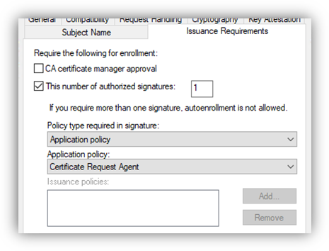

5. Under Subject Name, choose the option **Build from this Active Directory information** and tick **User principal name (UPN)** . You can optionally include the user’s email address into the certificates, but if the user you want to issue does not have an email address set then the request will fail.

> UserPrincipalName is often the best attribute to use for authenticating users, as it must be unique and it provides the user’s domain name too.

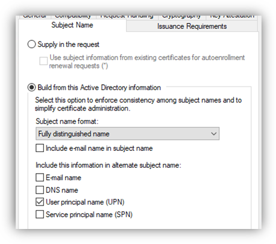

6. Finally, once your certificate template is created, you’ll need to open **certsrv.msc** and right-click **Certificate Templates** and choose **New > Certificate Template to Issue**, selecting your newly created template.

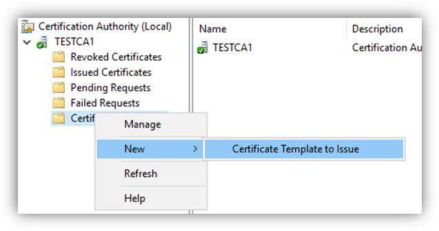

#### 9C Signing Key

The 9C container should only have a key that can be used for digitally signing information. This includes signing documents, emails, and other content. To create this certificate template, duplicating the **Smartcard User** template that comes with ADCS is a good starting point.

1. For this certificate, you’ll typically want to tick **E-mail name** and **Include e-mail name in subject name** for the Subject, as most signatures are based on a user’s email address.

2. Under Request Handling, tick **Allow private key to be exported**.

3. Under Issuance Requirements, tick **This number of authorized signatures**, set it to **1**, the Policy type required in signature to **Application policy** and the Application policy **Certificate Request Agent**.

> This setting will ensure that requests for this type of certificate must contain a signature from an Enrollment Agent certificate.

4. Including **Secure Email** in the Application policies is recommended.

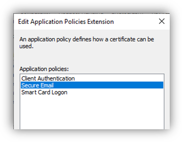

5. And ticking **Signature is proof of origin (nonrepudiation)** under Key Usages is also recommended.

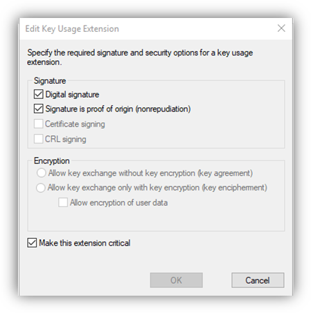

6. Finally, once your certificate template is created, you’ll need to open **certsrv.msc** and right-click **Certificate Templates** and choose **New > Certificate Template to Issue**, selecting your newly created template.

#### 9D Encryption Key

The 9D container should only have a key that can be used for encrypting data. This includes encrypting documents, emails, and other content. Encryption certificates are also typically required to be archived, so that you can always decrypt data created by it even once the certificate has expired. To create this certificate template, duplicating the **Basic EFS** template that comes with ADCS is a good starting point.

1. For this certificate, you’ll typically want to tick **E-mail name** and **Include e-mail name in subject name** for the Subject, as this will be needed for encrypting emails and other artefacts.

2. Under Request Handling, make sure the purpose is set to **Encryption** and  **Allow private key to be exported** is ticked.

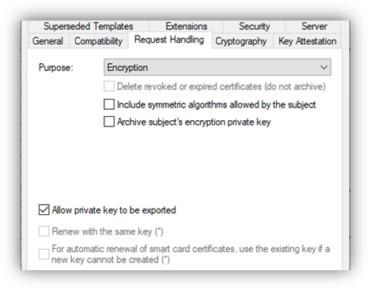

3. Under Issuance Requirements, tick **This number of authorized signatures**, set it to **1**, the Policy type required in signature to **Application policy** and the Application policy **Certificate Request Agent**.

> This setting will ensure that requests for this type of certificate must contain a signature from an Enrollment Agent certificate.

4. Including **Secure Email**, **Document Encryption**, and **Encrypting File System** in the Application policies is recommended.

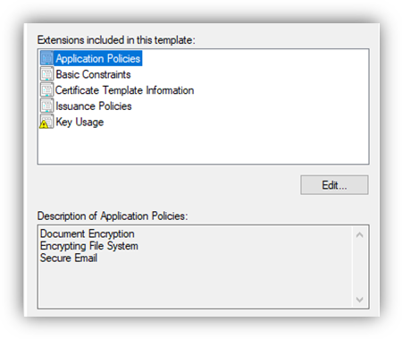

5. And ticking **Allow key exchange only with key encryption (key encipherment)** under Key Usages is also recommended.

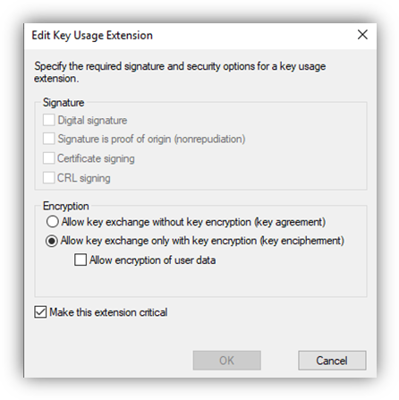

6. Finally, once your certificate template is created, you’ll need to open **certsrv.msc** and right-click **Certificate Templates** and choose **New > Certificate Template to Issue**, selecting your newly created template.

#### 9E Card Authentication Key

The 9E container should only have a key that can be used for physical access control systems, such as building entry doors or boomgates. This container **does not** require a PIN to be provided by the user, so configuration of the certificate templates must be taken with care.

Should you wish to use this key container, and you are unsure of the required key usages, please contact Signata Support.

## Signata Standalone Service Configuration

By default Signata Standalone is installed into the directory **C:\Program Files (x86)\Signata Standalone Server**. Within this directory there is a file called **appsettings.json**. This is the first file you will need to configure.

Please ensure this file stays as JSON formatted text, otherwise the server will fail to read it.

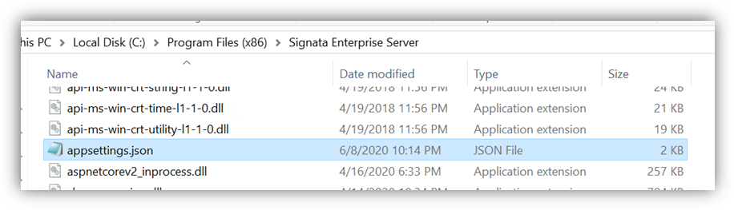

### Directory Configuration

Settings | Example or Default Value | Explanation
-------- | ------------------------ | -----------
DirectoryType | ActiveDirectory | Reserved for future use. This does not need to be modified at this time.
DirectoryUsername | svc_signata@yourdomain.com | The userPrincipalName of the service account created for read-only access to the directory.
DirectoryPassword | N0t4u2c | The password for the service account created for read-only access to the directory.
DirectorySearchFilter | (&(objectCategory=user)(sAMAccountName=\*{0}\*)) | This search filter should not need to be modified. If you wish to search on attributes other than sAMAccountName, or add more filters, then please note that the search parameters sent from the client are passed in to replace the “{0}” characters.
DirectoryLdapsEnabled | true | It is recommended to leave this field as true, but if you have connection problems with the directory changing this to false can be useful for verifying that the LDAPS certificate is the cause.
DirectoryPath | LDAP://hostname/OU=Users,OU=Company,DC=example,DC=com | Do not change “LDAP” to “LDAPS” to enable LDAPS traffic – this setting must always be set to “LDAP”. Set the hostname to your domain name, or a specific AD server. Set the last part as the part of the directory that you want to search for users inside (so you can filter out other directory segments containing service accounts or other irrelevant objects).

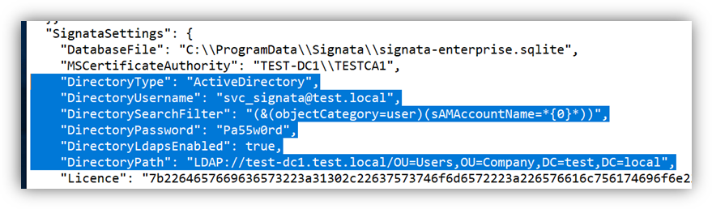

### Certificate Authority Configuration

The **MSCertificateAuthority** setting simply defines the name of your Microsoft Enterprise Certification Authority (CA). The name of your CA is usually written as "CAServer\CAName". As this configuration value is in JSON format, you need to escape the backslash in the name by adding a second backslash, so it reads like "CAServer\\\CAName".

This name should be sufficient for Signata to connect to the CA and read configuration from it.

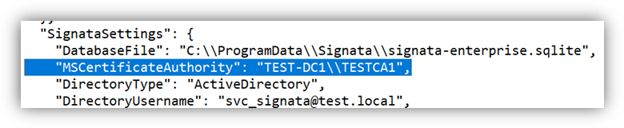

### API Key Configuration

Every desktop client that connects to Signata must use an API Key to authenticate. These keys are defined in the configuration file as the **ClientApiKeys** field.

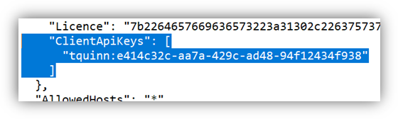

Each key must be defined as “name:key”, where name can be any unique name, and the key can be any text value you like.

To easily add more keys, you can just use the Signata standalone executable from an Administrative command prompt window by running *SignataEnterpriseServer.exe -AddClient [clientname]* where [clientname] is the desired name you wish to use. This command will generate a new client and add it to the configuration file, and the GUID that appears in response will be what you need to provide in the desktop client when it is first launched.

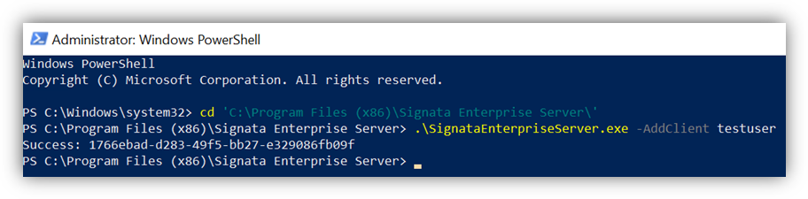

> Warning: be careful with storing the client API key. Should the API key be stolen, then an attacker could request certificates from the Signata server for any user. If you suspect a key may be compromised, simply remove it from the configuration file and restart the service to immediately revoke it.

### Product Licence

Signata MFA requires a product licence to operate. This licence is validated on both the server and the desktop client. Once you have received your product licence from the Signata MFA website, simply paste the contents into the Licence field in the configuration file.

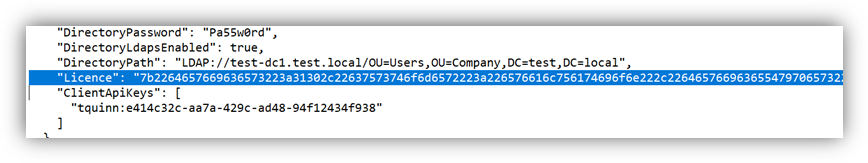

The licence contains two parts – the first is a hexadecimal encoded version of the licence, and the second is a base64 encoded digital signature to prevent tampering. The "|" character in the middle marks the split between these two parts.

## Post Configuration

Once all configuration settings have been set, simply start the *Signata Enterprise Service* again for the changes to take effect.

Should any settings be incorrectly set, then the *Application* Windows Event Log will contain errors that can be used to troubleshoot the problem.
