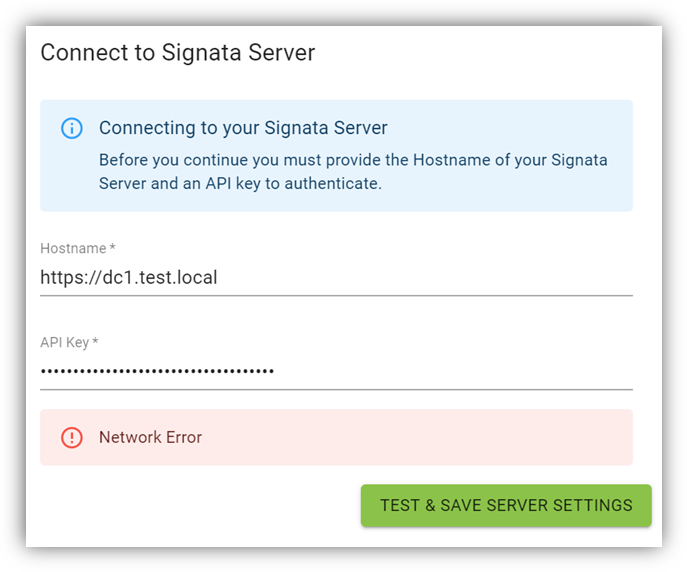
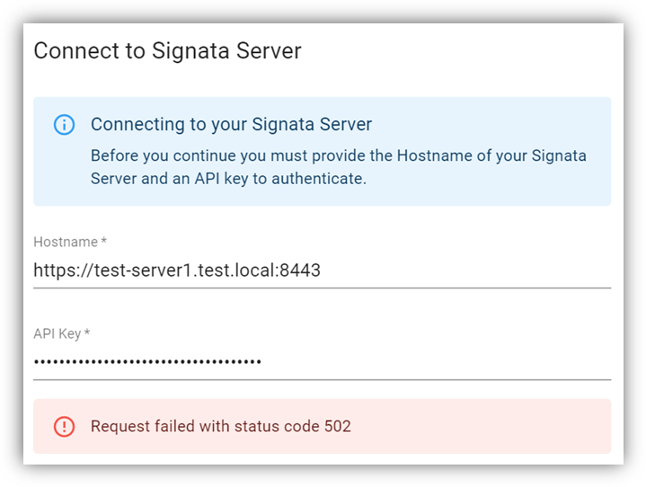
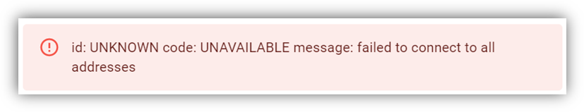

# Signata MFA Standalone Troubleshooting Guide

## Network Error

Type | Content
---- | -------
Error Message | Network Error
During | Connecting to Signata Server from Client
Cause(s) | May be caused by the following: Signata Server is unavailable. Hostname does not match certificate name. The certificate for server is not trusted by the client.
Solution(s) | Ensure that the Signata Server is up and can be connected to from the client machine. Ensure the port and protocol (https:// or http://) is correct. Ensure that the certificate for https:// is correct.

## Request Failed with Status Code 502

Type | Content
---- | -------
Error Message | Request Failed With Status Code 502
During | Connecting to Signata Server from Client
Cause(s) | May be caused by the following: Signata Server is down, but the Reverse Proxy is up.
Solution(s) | Ensure that the Signata Server is up and can be connected to from the client machine. Ensure the port and protocol (https:// or http://) is correct. Ensure that the certificate for https:// is correct.

## id: UNKNOWN code: UNAVAILABLE message: failed to connect to all addresses

Type | Content
---- | -------
Error Message | id: UNKNOWN code: UNAVAILABLE message: failed to connect to all addresses
During | Any interaction with devices
Cause(s) | May be caused by the following: Signata Device Manager service is down or unavailable.
Solution(s) | Restart the Signata Standalone application. Check that local system firewall rules are not blocking the device manager service.

